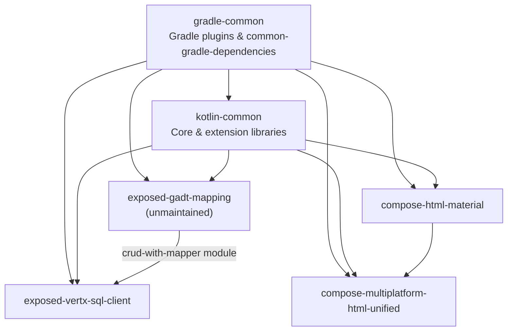

# Agent instructions — Huanshankeji open source

Instructions for AI coding agents working on **public Kotlin libraries** published by [Chengdu Huanshan Technology](https://github.com/huanshankeji) (`@huanshankeji`). We focus on [Kotlin Multiplatform](https://kotlinlang.org/docs/multiplatform.html), [Vert.x](https://vertx.io/), functional programming, and type-safety.

This file is [`docs/general-agent-instructions.md`](https://github.com/huanshankeji/.github/blob/main/docs/general-agent-instructions.md) in the [`.github`](https://github.com/huanshankeji/.github) organization repository. For **this** repo, start with the root [`AGENTS.md`](../AGENTS.md). Other projects may add their own `AGENTS.md`, `CLAUDE.md`, or `.github/copilot-instructions.md`; **follow those for repo-specific build steps and architecture**, and use this file for organization-wide standards and library relationships.

---

## Required reading

### Every Kotlin open-source task

| Topic | Document |
| --- | --- |
| Kotlin formatting and idioms | [kotlin-code-style.md](kotlin-code-style.md) |
| Snapshot / cross-repo development | [dev-instructions.md](dev-instructions.md) |
| Engineering principles (FP, types, modularity) | [kotlin-coding-and-software-engineering-guidelines.md](kotlin-coding-and-software-engineering-guidelines.md) |

### Code review tasks only

| Topic | Document |
| --- | --- |
| Code review behavior | [code-review-instructions.md](code-review-instructions.md) |

---

## Agent skills

We publish reusable [Agent Skills](https://agentskills.io) for workflows that agents should not improvise. **When a task matches a skill’s description, load and follow that skill** (via your platform’s skill tool, or by reading the skill’s `SKILL.md`) instead of inventing steps from scratch.

| Repository | Scope |
| --- | --- |
| [kotlin-skills](https://github.com/huanshankeji/kotlin-skills) | Kotlin, Gradle, and JVM/KMP build workflows |
| [skills](https://github.com/huanshankeji/skills) | General agent skills (not Kotlin-specific) |

Also see [Kotlin/kotlin-agent-skills](https://github.com/Kotlin/kotlin-agent-skills) for skills maintained by JetBrains.

### Installation

Install into the target repository (or your global skills directory) with the [skills CLI](https://github.com/vercel-labs/skills). Skills live in subdirectories under each repo’s `skills/` folder, so point at a specific skill path:

```bash
npx skills add huanshankeji/kotlin-skills/skills/gradle-wrapper-update
npx skills add huanshankeji/kotlin-skills/skills/kotlin-debugging-unresolved-reference-file-clash
npx skills add huanshankeji/skills/skills/<skill-name>
```

Or copy individual skill folders from a repo’s `skills/` directory into a project-local skills path (for example `.agents/skills/`, `.github/skills/`, or `.claude/skills/`). See each repository’s README for layout details.

Do **not** commit installed skill files to the repository unless explicitly asked to install skills there.

### kotlin-skills catalog

| Skill | Use when |
| --- | --- |
| [gradle-wrapper-update](https://github.com/huanshankeji/kotlin-skills/tree/main/skills/gradle-wrapper-update) | Upgrading or downgrading the Gradle wrapper (`gradlew`, `gradle-wrapper.properties`, `gradle-wrapper.jar`) |
| [kotlin-debugging-unresolved-reference-file-clash](https://github.com/huanshankeji/kotlin-skills/tree/main/skills/kotlin-debugging-unresolved-reference-file-clash) | Kotlin JVM or KMP reports “Unresolved reference” (or similar) even though the symbol exists and dependencies look correct — especially after adding, moving, or renaming `.kt` files with top-level declarations |

### skills catalog

Check [skills](https://github.com/huanshankeji/skills) for general-purpose skills that apply across stacks. Prefer a repo-local or org skill over ad hoc steps when one matches the task.

---

## Open source Kotlin project hierarchy

**Only public, non-fork Kotlin repositories** created by `@huanshankeji` are listed below.

### Dependency layers

Build tooling sits at the bottom; runtime libraries stack upward. Arrows mean “depends on (directly or via published artifacts / build logic)”.



- **gradle-common** — Shared Gradle plugins (`kotlin-common-gradle-plugins`, `gradle-plugins`, `common-gradle-dependencies`, etc.). Other repos pull these into `buildSrc` for aligned Kotlin, Compose, Dokka, and dependency versions. Not a runtime app dependency for end users, but required to build sibling libraries.
- **kotlin-common** — Foundation Kotlin/KMP extensions (core, coroutines, Exposed, Vert.x, Ktor, Arrow, etc.). Most other libraries depend on one or more `kotlin-common-*` modules.
- **exposed-gadt-mapping** — Exposed DSL mappings with GADT-style modeling. **No longer actively maintained**; mapping code is usually generated ad hoc with AI agents instead. Still published and used by the optional `crud-with-mapper` module in **exposed-vertx-sql-client**.
- **exposed-vertx-sql-client** — Run Exposed statements on Vert.x reactive SQL clients (PostgreSQL, MySQL, Oracle, SQL Server). The optional **`crud-with-mapper`** module integrates **exposed-gadt-mapping**.
- **compose-html-material** — Material 3 wrappers for Compose HTML (Material Web).
- **compose-multiplatform-html-unified** — Unified Compose Multiplatform APIs for Compose UI and Compose HTML; **compose-html-material** is a DOM/Material source for the HTML side.

### Repository catalog

| Repository | Role | Notes |
| --- | --- | --- |
| [gradle-common](https://github.com/huanshankeji/gradle-common) | Build infrastructure | [Plugin portal](https://plugins.gradle.org/search?term=com.huanshankeji); [API docs](https://huanshankeji.github.io/gradle-common/) |
| [kotlin-common](https://github.com/huanshankeji/kotlin-common) | Shared Kotlin/KMP libraries | [Maven Central](https://search.maven.org/search?q=g:com.huanshankeji%20a:kotlin-common-*); [API docs](https://huanshankeji.github.io/kotlin-common/) |
| [exposed-gadt-mapping](https://github.com/huanshankeji/exposed-gadt-mapping) | Exposed GADT mapping | Unmaintained now; Highly experimental; [API docs](https://huanshankeji.github.io/exposed-gadt-mapping/) |
| [exposed-vertx-sql-client](https://github.com/huanshankeji/exposed-vertx-sql-client) | Exposed + Vert.x SQL client | JVM; see repo `CONTRIBUTING.md` / copilot instructions |
| [compose-html-material](https://github.com/huanshankeji/compose-html-material) | Compose HTML Material 3 | [API docs](https://huanshankeji.github.io/compose-html-material/api-documentation/) |
| [compose-multiplatform-html-unified](https://github.com/huanshankeji/compose-multiplatform-html-unified) | CMP + HTML unified UI | [Demo](https://huanshankeji.github.io/compose-multiplatform-html-unified/demo/); [API docs](https://huanshankeji.github.io/compose-multiplatform-html-unified/api-documentation/) |

### Related organization resources

- **Profile / intro:** [profile/README.md](../profile/README.md)
- **Agent skills:** [kotlin-skills](https://github.com/huanshankeji/kotlin-skills), [skills](https://github.com/huanshankeji/skills) — see [Agent skills](#agent-skills)
- **Shared CI & Actions:** workflow templates and composite actions in this repo (`workflow-templates/`, `actions/`)

---

## Working on a single repository

1. Open the target repo and read its `README.md`, `CONTRIBUTING.md`, and any repo-local agent file (`AGENTS.md`, `.github/copilot-instructions.md`).
2. Apply the [required reading](#required-reading) for the task type.
3. If the task matches an [agent skill](#agent-skills) (Gradle wrapper updates, misleading Kotlin “Unresolved reference” errors, or a skill in [skills](https://github.com/huanshankeji/skills)), install or load that skill and follow it.
4. If the task spans multiple repos (typical on `dev` with snapshots), follow [dev-instructions.md](dev-instructions.md) before running `./gradlew check` or `./gradlew build`.

When instructions conflict, **repo-local agent docs and maintainers’ task directions win**; this file provides the shared baseline and library map.
