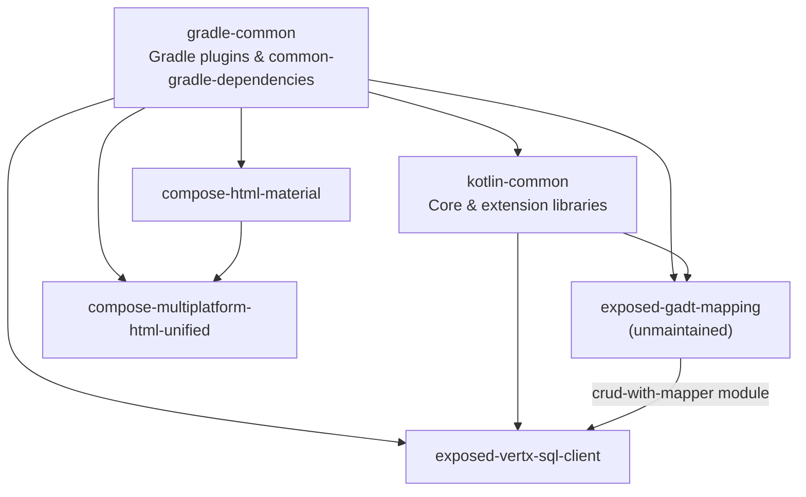

# Agent instructions — Huanshankeji

Instructions for AI coding agents working on **Kotlin projects** by [Chengdu Huanshan Technology](https://github.com/huanshankeji) (`@huanshankeji`). We focus on [Kotlin Multiplatform](https://kotlinlang.org/docs/multiplatform.html), [Vert.x](https://vertx.io/), functional programming, and type-safety.

This file is [`docs/general-agent-instructions.md`](https://github.com/huanshankeji/.github/blob/main/docs/general-agent-instructions.md) in the [`.github`](https://github.com/huanshankeji/.github) organization repository. For **this** repo, start with the root [`AGENTS.md`](../AGENTS.md). Other projects may add their own `AGENTS.md`, `CLAUDE.md`, or `.github/copilot-instructions.md`; **follow those for repo-specific build steps and architecture**, and use this file for organization-wide standards and library relationships.

---

## Required reading

### Every Kotlin task

| Topic | Document |
| --- | --- |
| Kotlin formatting and idioms | [kotlin-code-style.md](kotlin-code-style.md) |
| Snapshot / cross-repo development | [dev-instructions.md](dev-instructions.md) |
| Engineering principles (FP, types, modularity) | [kotlin-coding-and-software-engineering-guidelines.md](kotlin-coding-and-software-engineering-guidelines.md) |

### Code review tasks only

| Topic | Document |
| --- | --- |
| Code review behavior | [code-review-instructions.md](code-review-instructions.md) |

---

## Open source Kotlin project hierarchy

**Only public, non-fork Kotlin repositories** created by `@huanshankeji` are listed below.

### Dependency layers

Build tooling sits at the bottom; libraries stack upward. Arrows mean “depends on (directly or via published artifacts / build logic)”.

- **gradle-common** — Shared Gradle plugins (`kotlin-common-gradle-plugins`, `gradle-plugins`, `common-gradle-dependencies`, etc.). Other repos pull these into `buildSrc` for aligned Kotlin, Compose, Dokka, and dependency versions. Not a library dependency (`api` / `implementation`) for consumers, but required to build sibling libraries.
- **kotlin-common** — Foundation Kotlin/KMP extensions (core, coroutines, Exposed, Vert.x, Ktor, Arrow, etc.). Some other libraries depend on one or more `kotlin-common-*` modules.
- **exposed-gadt-mapping** — Exposed DSL mappings with GADT-style modeling. **No longer actively maintained**; mapping code is usually generated ad hoc with AI agents instead. Still published and used by the optional `crud-with-mapper` module in **exposed-vertx-sql-client**.
- **exposed-vertx-sql-client** — Run Exposed statements on Vert.x reactive SQL clients (PostgreSQL, MySQL, Oracle, SQL Server). The optional **`crud-with-mapper`** module integrates **exposed-gadt-mapping**.
- **compose-html-material** — Material 3 wrappers for Compose HTML (Material Web).
- **compose-multiplatform-html-unified** — Unified Compose Multiplatform APIs for Compose UI and Compose HTML; **compose-html-material** is a DOM/Material source for the HTML side.

### Repository catalog

| Repository | Role | Notes |
| --- | --- | --- |
| [gradle-common](https://github.com/huanshankeji/gradle-common) | Build infrastructure | [Plugin portal](https://plugins.gradle.org/search?term=com.huanshankeji); [API docs](https://huanshankeji.github.io/gradle-common/) |
| [kotlin-common](https://github.com/huanshankeji/kotlin-common) | Shared Kotlin/KMP libraries | [Maven Central](https://search.maven.org/search?q=g:com.huanshankeji%20a:kotlin-common-*); [API docs](https://huanshankeji.github.io/kotlin-common/) |
| [exposed-gadt-mapping](https://github.com/huanshankeji/exposed-gadt-mapping) | Exposed GADT mapping | Unmaintained now; Highly experimental; [API docs](https://huanshankeji.github.io/exposed-gadt-mapping/) |
| [exposed-vertx-sql-client](https://github.com/huanshankeji/exposed-vertx-sql-client) | Exposed + Vert.x SQL client | JVM; see repo `CONTRIBUTING.md` / copilot instructions |
| [compose-html-material](https://github.com/huanshankeji/compose-html-material) | Compose HTML Material 3 | [API docs](https://huanshankeji.github.io/compose-html-material/api-documentation/) |
| [compose-multiplatform-html-unified](https://github.com/huanshankeji/compose-multiplatform-html-unified) | CMP + HTML unified UI | [Demo](https://huanshankeji.github.io/compose-multiplatform-html-unified/demo/); [API docs](https://huanshankeji.github.io/compose-multiplatform-html-unified/api-documentation/) |

### Related organization resources

- **Profile / intro:** [profile/README.md](../profile/README.md)
- **Shared CI & Actions:** workflow templates and composite actions in this repo (`workflow-templates/`, `actions/`)

---

## Working on a single repository

1. Open the target repo and read its `README.md`, `CONTRIBUTING.md`, and any repo-local agent file (`AGENTS.md`, `.github/copilot-instructions.md`).
2. Apply the [required reading](#required-reading) for the task type.
3. If the task spans multiple repos (typical with `*-dev-commit-*` / dirty-SNAPSHOT dependencies), follow [dev-instructions.md](dev-instructions.md) before running `./gradlew check` or `./gradlew build`.
4. When working across **multiple Gradle projects** in one session, pass **`--no-daemon`** on every `./gradlew` invocation (and run `./gradlew --stop` first if daemons are already running). Many concurrent daemons can exhaust memory and crash the machine.

When instructions conflict, **repo-local agent docs and maintainers’ task directions win**; this file provides the shared baseline and library map.

---

## Editing existing files

When changing code, **preserve existing comments and blank lines** unless the user explicitly asks you to remove or reformat them, or the change inherently requires it (for example, deleting the code a comment describes).

- Do not remove comments on your own judgment — even if they look redundant, outdated, or unnecessary.
- Do not remove or collapse blank lines to “clean up” formatting or shrink the diff.
- Do not reformat unrelated parts of a file (whitespace, line breaks, comment style) while making a focused change.

Keep edits minimal: change only what the task requires, and leave surrounding comments and vertical spacing as you found them.

## Avoid unnecessary changes

Try **not** to make unnecessary changes, especially in PRs. Focus the diff on the task; do not leave behind drive-by cleanup, speculative refactors, or temporary scaffolding that is not part of the requested work.

If possibly unnecessary changes were made during debugging or testing:

1. **Revert / restore them afterwards** once they are no longer needed.
2. If such changes are **uncommitted**, revert / restore **before committing**.
3. If such changes were **committed** and are confirmed unnecessary — especially in a PR — **commit again** to revert / restore.
4. If they are needed for further review or debugging and **cannot** be reverted / restored immediately, leave a **TODO** in the code **and** in the PR description to revert / restore.
