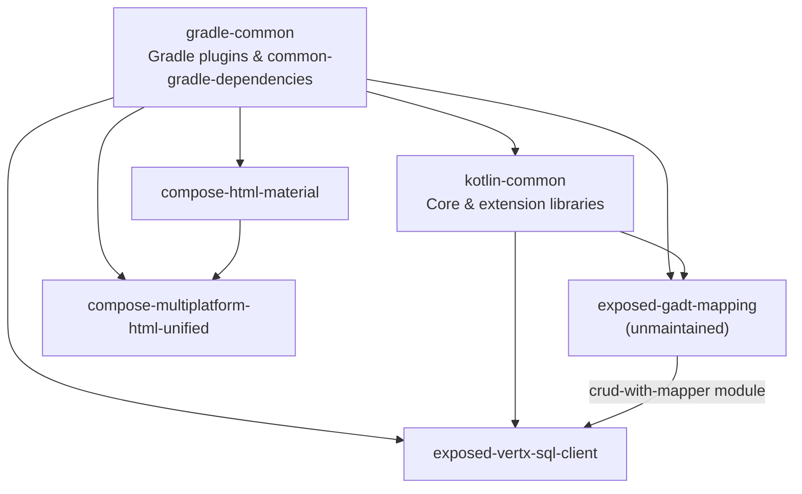

# Open source Kotlin project hierarchy

**Only public, non-fork Kotlin repositories** created by `@huanshankeji` are listed below, plus [`.github`](https://github.com/huanshankeji/.github) for shared CI.

For **multi-repo / cross-repo** work, use [dev-instructions.md](dev-instructions.md). This page is the library map.

Build tooling sits at the bottom; libraries stack upward. Arrows mean “depends on (directly or via published artifacts / build logic)”.

| Repository | Role | Notes |
| --- | --- | --- |
| [.github](https://github.com/huanshankeji/.github) | Shared CI & Actions | Reusable `gradle-ci.yml` / `open-source-convention-gradle-maven-publish.yml`; composite `actions/`; starter `workflow-templates/`. Details: [dev-instructions.md](dev-instructions.md#ci-and-publishing) |
| [gradle-common](https://github.com/huanshankeji/gradle-common) | Build infrastructure | Plugins into `buildSrc`; not an `api` / `implementation` library. [Plugin portal](https://plugins.gradle.org/search?term=com.huanshankeji); [API docs](https://huanshankeji.github.io/gradle-common/) |
| [kotlin-common](https://github.com/huanshankeji/kotlin-common) | Shared Kotlin/KMP libraries | [Maven Central](https://search.maven.org/search?q=g:com.huanshankeji%20a:kotlin-common-*); [API docs](https://huanshankeji.github.io/kotlin-common/) |
| [exposed-gadt-mapping](https://github.com/huanshankeji/exposed-gadt-mapping) | Exposed GADT mapping | Unmaintained; highly experimental; optional `crud-with-mapper` in **exposed-vertx-sql-client**. [API docs](https://huanshankeji.github.io/exposed-gadt-mapping/) |
| [exposed-vertx-sql-client](https://github.com/huanshankeji/exposed-vertx-sql-client) | Exposed + Vert.x SQL client | JVM |
| [compose-html-material](https://github.com/huanshankeji/compose-html-material) | Compose HTML Material 3 | [API docs](https://huanshankeji.github.io/compose-html-material/api-documentation/) |
| [compose-multiplatform-html-unified](https://github.com/huanshankeji/compose-multiplatform-html-unified) | CMP + HTML unified UI | **compose-html-material** is a DOM/Material source for the HTML side. [Demo](https://huanshankeji.github.io/compose-multiplatform-html-unified/demo/); [API docs](https://huanshankeji.github.io/compose-multiplatform-html-unified/api-documentation/) |
